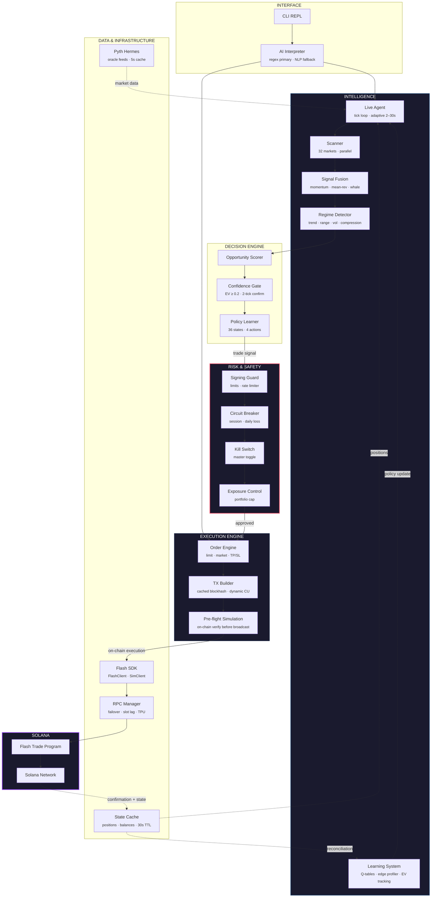

# Architecture

Flash Terminal is 7 isolated layers with strict downward communication. The risk layer sits between every decision and every transaction — no bypass path exists. Market data flows up through caches, execution flows down through safety gates, and the agent's learning loop closes through on-chain state reconciliation.

## System Architecture

## Layer Breakdown

**Interface.** The CLI REPL (`src/cli/terminal.ts`) accepts user input and routes it through a three-tier parser: fast dispatch for single-token commands, regex patterns for structured commands, and LLM fallback for natural language. Output is always a `ParsedIntent` struct — the rest of the system never sees raw text.

**Intelligence.** The autonomous agent (`src/agent/`) runs a tick loop (adaptive 2-30s interval) that scans 32 markets in parallel. Three independent strategies (momentum, mean reversion, whale follow) generate signals. The regime detector classifies each market's condition (trend, range, volatility, compression) and adjusts strategy weights accordingly. A Q-learning system with 36 states and 4 actions refines policy over time.

**Decision Engine.** Raw signals are scored by opportunity strength, regime fit, and risk-reward ratio. The confidence gate requires EV of at least 20 bps after costs and 2-tick price confirmation. The policy learner makes the final trade/skip/scale decision based on accumulated Q-table weights.

**Risk & Safety.** Four independent gates in series: signing guard (per-trade limits + rate limiter), circuit breaker (session/daily loss caps), kill switch (master toggle), and exposure control (portfolio-level cap). Every trade passes through all four. See [Risk & Safety Systems](./risk-safety.md) for full detail.

**Execution Engine.** The order engine handles market orders, limit orders, and TP/SL. The TX builder compiles `MessageV0` with cached blockhash and dynamic compute units. Pre-flight simulation runs on-chain before broadcast — program errors abort before funds are at risk.

**Data & Infrastructure.** The Flash SDK client (live or simulated) sits behind the `IFlashClient` interface. The RPC manager handles multi-endpoint failover with slot lag detection. Pyth Hermes provides oracle prices with a 5s cache. State cache holds positions and balances with a 30s TTL, invalidated post-trade.

**Flash Trade Protocol.** The on-chain program on Solana. Flash Terminal reads all parameters (fees, margins, leverage limits, liquidation math) from `CustodyAccount` state. It never overrides protocol values.

## Execution Pipeline

When you type `open 5x long SOL $100`, seven steps execute in sequence:

1. **Parse.** Regex parser extracts intent: market=SOL, side=long, leverage=5, collateral=$100.
2. **Resolve pool.** `getPoolForMarket()` maps SOL to the correct Flash Trade pool from on-chain `PoolConfig`.
3. **Fetch price.** Pyth Hermes oracle returns the current price with staleness (<30s), confidence (<2%), and deviation checks.
4. **Signing guard.** Trade parameters are validated against configured limits. Full summary is displayed. You confirm.
5. **Simulate.** Transaction is simulated on-chain. Program errors (insufficient margin, invalid leverage) abort here.
6. **Freeze instructions.** `Object.freeze()` locks the instruction array. Program whitelist is enforced.
7. **Broadcast.** `sendRawTransaction` with maxRetries:3. HTTP polling confirms. State reconciler verifies the position exists on-chain.

No step is hidden. No step is skippable.

## Agent Decision Loop

The agent operates a closed-loop cycle: observe market state, generate and score signals, filter through risk gates, execute on-chain, then update policy weights based on realized outcomes. Every cycle feeds the next.

```mermaid
graph LR
    subgraph OBSERVE["&nbsp; OBSERVE &nbsp;"]
        MKT["Fetch Prices<br/><sub>Pyth · cached 5s</sub>"]
        POS["Fetch Positions<br/><sub>on-chain · cached 20s</sub>"]
        EVT["Event Triggers<br/><sub>price spike · OI shift · funding flip</sub>"]
    end

    subgraph ANALYZE["&nbsp; ANALYZE &nbsp;"]
        SIG["Signal Fusion<br/><sub>6 strategies · Bayesian</sub>"]
        REG["Regime Classification<br/><sub>per-market state</sub>"]
    end

    subgraph SCORE_FILTER["&nbsp; SCORE & FILTER &nbsp;"]
        OPP["Opportunity Scorer<br/><sub>strength · regime fit · R:R</sub>"]
        EV["EV Validation<br/><sub>≥ 20 bps after costs</sub>"]
        POL["Policy Decision<br/><sub>trade · skip · scale</sub>"]
    end

    subgraph EXECUTE_LEARN["&nbsp; EXECUTE & LEARN &nbsp;"]
        EXEC["Execute Trade<br/><sub>full safety stack</sub>"]
        RESULT["Observe Outcome<br/><sub>PnL · slippage · fill time</sub>"]
        UPDATE["Update Policy<br/><sub>Q-learning · reward shaping</sub>"]
        EDGE["Edge Profiler<br/><sub>real EV · cost drag · Sharpe</sub>"]
    end

    MKT --> SIG
    POS --> SIG
    EVT -->|"fast path"| SIG
    SIG --> REG
    REG --> OPP
    OPP --> EV
    EV --> POL

    POL -->|"approved"| EXEC
    POL -.->|"skip"| MKT

    EXEC --> RESULT
    RESULT --> UPDATE
    RESULT --> EDGE
    UPDATE -.->|"policy weights"| POL
    EDGE -.->|"strategy disable"| SIG

    style SCORE_FILTER fill:#1a1a2e,stroke:#e94560,stroke-width:2px,color:#fff
    style EXECUTE_LEARN fill:#1a1a2e,stroke:#0f3460,stroke-width:2px,color:#fff
```

## Data Flow

Three flows run concurrently:

**Upward (market data).** Pyth oracle prices and on-chain state flow up through tiered caches (5s prices, 15s snapshots, 30s balances) into the intelligence layer. The agent consumes cached data — it never queries RPC directly.

**Downward (execution).** Trade signals flow down through the four risk gates, into the order engine, through simulation, and onto the chain. Each gate can reject. Rejection is final for that signal.

**Circular (learning).** After a trade confirms, the state reconciler syncs on-chain state back into the cache. The edge profiler computes realized PnL, slippage, and cost drag. Q-learning updates policy weights. The next tick cycle uses the updated policy. The loop is closed.
