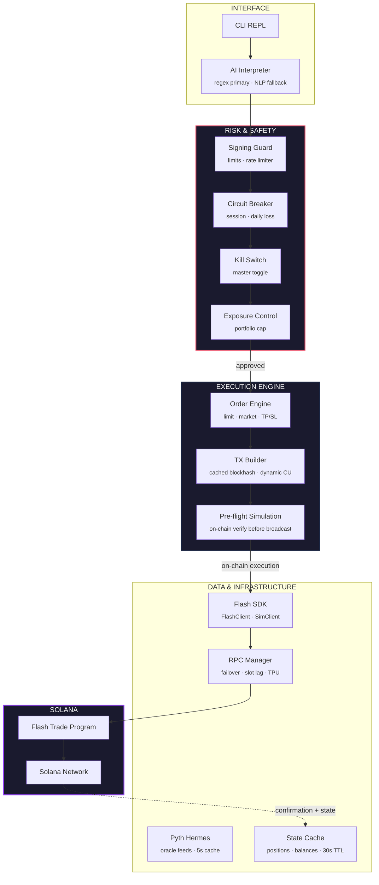

# Architecture

Flash Terminal is built as isolated layers with strict downward communication. The risk layer sits between every decision and every transaction — no bypass path exists. Market data flows up through caches, execution flows down through safety gates.

## System Architecture

## Layer Breakdown

**Interface.** The CLI REPL (`src/cli/terminal.ts`) accepts user input and routes it through a three-tier parser: fast dispatch for single-token commands, regex patterns for structured commands, and LLM fallback for natural language. Output is always a `ParsedIntent` struct — the rest of the system never sees raw text.

**Risk & Safety.** Four independent gates in series: signing guard (per-trade limits + rate limiter), circuit breaker (session/daily loss caps), kill switch (master toggle), and exposure control (portfolio-level cap). Every trade passes through all four. See [Risk & Safety Systems](./risk-safety.md) for full detail.

**Execution Engine.** The order engine handles market orders, limit orders, and TP/SL. The TX builder compiles `MessageV0` with cached blockhash and dynamic compute units. Pre-flight simulation runs on-chain before broadcast — program errors abort before funds are at risk.

**Data & Infrastructure.** The Flash SDK client (live or simulated) sits behind the `IFlashClient` interface. The RPC manager handles multi-endpoint failover with slot lag detection. Pyth Hermes provides oracle prices with a 5s cache. State cache holds positions and balances with a 30s TTL, invalidated post-trade.

**Flash Trade Protocol.** The on-chain program on Solana. Flash Terminal reads all parameters (fees, margins, leverage limits, liquidation math) from `CustodyAccount` state. It never overrides protocol values.

## Execution Pipeline

When you type `open 5x long SOL $100`, seven steps execute in sequence:

1. **Parse.** Regex parser extracts intent: market=SOL, side=long, leverage=5, collateral=$100.
2. **Resolve pool.** `getPoolForMarket()` maps SOL to the correct Flash Trade pool from on-chain `PoolConfig`.
3. **Fetch price.** Pyth Hermes oracle returns the current price with staleness (<30s), confidence (<2%), and deviation checks.
4. **Signing guard.** Trade parameters are validated against configured limits. Full summary is displayed. You confirm.
5. **Simulate.** Transaction is simulated on-chain. Program errors (insufficient margin, invalid leverage) abort here.
6. **Freeze instructions.** `Object.freeze()` locks the instruction array. Program whitelist is enforced.
7. **Broadcast.** `sendRawTransaction` with maxRetries:3. HTTP polling confirms. State reconciler verifies the position exists on-chain.

No step is hidden. No step is skippable.

## Data Flow

Two flows run concurrently:

**Upward (market data).** Pyth oracle prices and on-chain state flow up through tiered caches (5s prices, 15s snapshots, 30s balances) into the interface layer. Cached data is always used — direct RPC queries are avoided.

**Downward (execution).** Trade commands flow down through the four risk gates, into the order engine, through simulation, and onto the chain. Each gate can reject. Rejection is final for that command.
